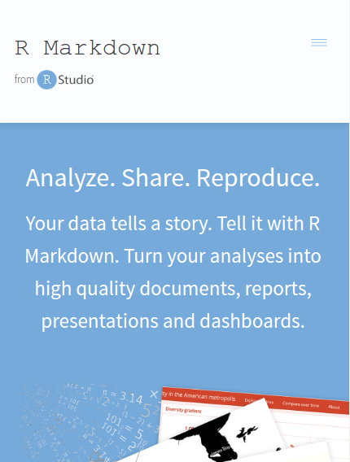

# What is **R Markdown** and why should you use it?

## 
### Use **R Markdown** to create **reproducible reports**




##
### **R Markdown** extends the **Markdown** language

>- Simple syntax (learn it in 5 minutes)
>- Source code is human readable
>- Code translates in a predictable way to HTML
>- Outputs to **HTML**, or **PDF** or **Word .doc** (*PanDoc*)
>- Use your own CSS and include raw HTML in your file
>- Markdown is used in Jupyter Notebooks, Github, etc.

##
### R Markdown adds **additional features**

>- Retains all Markdown syntax and features
>- Integrated into *RStudio*
>- Handles **LaTeX** mathematical notation (*MathJax*)
>- Place **R** code and figures directly in your RMarkdown code
>- Create slides like this presentation! (*RevealJS*)

---
# Pros and Cons

## Why am I so hype? 

>- Already use a lot of R
>- Great for homework that require LaTeX
>- Version Control (R Markdown is code)
>- Markdown (and R Markdown) is simple and fast
>- Reproducibility (embedded code and figures)
>- Great looking files

## Downsides

- Only available in RStudio
- Translations to HTML are not always consistent (not pixel-perfect)
- Not suitable for journal publications

---
# 5 minute crash course in **Markdown**

## Learn By Doing

- Open an Online Markdown Editor
    
    - Go to [http://dillinger.io](http://www.dillinger.io/)
    - Delete the filler text. 
    - Click the **left panel** $\rightarrow$ **Ctrl+A** $\rightarrow$ **Backspace**

## Headings

```
# Heading 1 

## Heading 2

... all the way down to ...

####### Heading 7
```

- Best practice is to put an extra blank line after each header.


## Paragraphs

```
This is a paragraph.

You don't have to do anything other than put a blank 
line before and after some text to indicate that it's 
a pargraph.

If you have some text.
A new line (but not a blank line)
All of the text is put together in a single paragraph.
```

## Text Formatting (Bold, Italics)

```
**Bold Text**

*Italics Text*

Non-standard markdown format:

~Strikethrough~

__Underline__
```

- Some versions of Markdown use non-standard syntax, but it isn't supported in
    RMarkdown.

## Simple Lists (Ordered and Unordered)

```
For unordered lists,

- Item 1
- Item 2
- Item 3

For ordered lists,

1. Item 1
2. Item 2
3. Item 3
```

- Put a blank line:
    - **before the start of the list** 
    - and, **after the end of the list**
- Don't put blank lines in the middle of the list (e.g., not between items).

## Nested lists and nested items

```
For unordered lists,

- Item 1
    - Use four spaces to get sublists
    - This is a sublist item.
        - You can nest even further.
- Item 2
     If you need to just have multiple paragraphs, you can also indent.
- Item 3

For ordered lists,

1. Item 1
    a. You can also nest ordered lists.
    b. This is another sublist item.
2. Item 2
```

- To get sub-bullet points, put in an indent before the new item.
- Indents are usually **four spaces**, **two spaces** or a **tab**.

## Code Blocks
<pre>
```
Put your code, or Markdown here.

Anything you put in here will be treated as plaintext. 
Markdown syntax you use between code blocks will not be 
translated into HTML.
```
</pre>

- Code in between three backticks (\```) will be treated as plaintext and blocked off.
- In the previous slides, we used these code blocks to show you the actual syntax
of the Markdown (otherwise, it would have been translated to HTML).
- These are also used to embed R code (more on that later).

## Additional Features
```
Links:
[Link Text](Hyperlink)

Images


Arbitrary HTML
<p>Just use the HTML in-line, nothing else needed./p>

Tables are also possible, although they are non-standard.
```

- Original Markdown Specification ([Daring Fireball](https://daringfireball.net/projects/markdown/))
- GitHub-Flavored Markdown Cheat Sheet ([GitHub](https://github.com/adam-p/markdown-here/wiki/Markdown-Cheatsheet))
- Markdown Table Generator ([here](http://www.tablesgenerator.com/markdown_tables))
- There are also a lot of non-standard Markdown features that are implemented in different flavors of Markdown.

# Step-by-step guide to R Markdown

## 1. Install Rstudio

- Link to RStudio
- Install some packages

## 2. Create a new Rmarkdown file
  
- YAML metadata
- Options
- Embedded R Code Blocks
- LaTeX code

## 3. Hit Knit to HTML

- Need to install LaTeX to get auto PDF
- HTML (or PDF) is setn to your folder

## Advanced

- Caching
- Making slides via Rmarkdown
- Code chunk controls
- Tables

## References

- LaTeX symbols
- Getting started with R
- KnitR